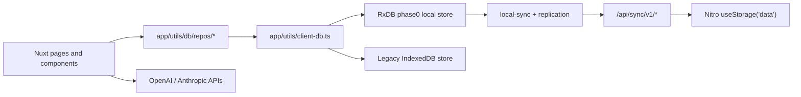

# Architecture

## Overview

Vibe Food is a client-rendered Nuxt application with a thin sync backend:

- The UI, product logic, and primary data ownership live in the browser.
- Local persistence uses IndexedDB, with syncable data moving through RxDB.
- The server exposes sync endpoints for vaults, devices, replication, keys, and pairing.
- Shared sync types and comparison logic live in `shared/` so client and server agree on payload shape and ordering.

## Runtime boundaries

### Client

The frontend lives under `app/` and is responsible for:

- rendering pages and components
- loading and normalizing local data
- storing settings, AI integration, and sync state
- starting and monitoring sync replication
- calling AI providers directly from the browser

Main client entry points:

- `app/app.vue`: app shell, navigation, and local sync startup on mount
- `app/pages/`: route-level UI
- `app/utils/db/repos/`: normalized domain persistence helpers
- `app/utils/sync/`: sync orchestration and transport

### Shared contract

`shared/utils/sync/protocol.ts` defines:

- sync collection names
- HTTP request/response shapes
- payload normalization
- checkpoint construction and comparison
- tombstone normalization
- last-write-wins ordering

This file is the sync contract between browser and server.

### Server

The sync backend lives under `server/` and is intentionally narrow:

- `server/api/sync/v1/`: HTTP routes
- `server/utils/sync/http.ts`: vault authentication helpers
- `server/utils/sync/storage.ts`: Nitro storage-backed persistence for vaults, devices, docs, keys, and pairing requests

The server does not compute meals, ingredients, or goals. It stores sync payloads and applies replication rules.

## Directory map

```text
app/
  app.vue
  pages/
  components/
  utils/
    db/
    sync/
shared/
  utils/sync/protocol.ts
server/
  api/sync/v1/
  utils/sync/
test/
  sync/
```

## Main data flow



## Route architecture

### `/`

Dashboard page showing the selected day's totals, macro split, and calorie progress.

### `/meals`

Meal list and entry surface:

- manual meal creation
- ingredient-composed meal creation
- JSON import
- AI-assisted meal import
- navigation into meal editor routes

### `/meals/new`, `/meals/import`, `/meals/:id`

All handled by `app/pages/meals/[id].vue`:

- `new`: empty editor
- `import`: consumes the session draft from AI or JSON import flow
- any other ID: edits an existing meal

### `/ingredients`

Ingredient CRUD, JSON export/import, and AI nutrition label import.

### `/settings`

Goals, AI integration, sync bootstrap/linking, device list, conflict history, recovery export, cloud-delete action, and local data reset.

## Local-first layering

There are two local persistence layers in play:

1. Legacy `idb` storage in `app/utils/client-db.ts`
2. RxDB-backed syncable storage in `app/utils/db/rxdb-phase0.ts`

`client-db.ts` bridges them and runs the phase-0 migration into RxDB for syncable keys. Reads and writes for syncable data are routed through RxDB once that store is ready.

## Architectural constraints

- `ssr: false` means browser-only assumptions are valid, but server-rendering patterns are not.
- Sync is optional. The app should remain useful with no server connectivity.
- The sync backend should remain generic and not absorb product-specific validation unless it is sync-related.
- Production sync durability depends on how Nitro `useStorage('data')` is configured by the deployment target.
